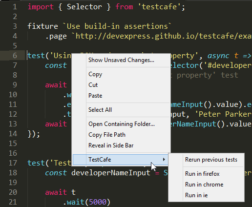
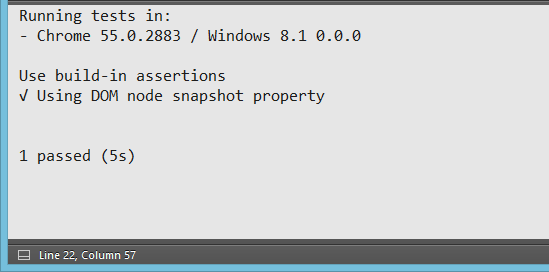
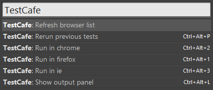

#TestCafe Test Runner for SublimeText 3
The **TestCafe TestRunner** plugin allows you to run your `testcafe` tests directly from your SublimeText 3 editor. Tests results will be displayed interactively in the separate panel.
The **TestCafe TestRunner** plugin adds a new section to the editor context menu and side bar. 

##Requirements

The plugin requires TestCafe installed globally on your machine. If you have not installed TestCafe, refer to the [installing testcafe](https://devexpress.github.io/testcafe/documentation/getting-started/#installing-testcafe) article. 

##How to install

You can install the **TestCafe Test Runner** plugin like any other SublimeText3 plugin, as it is described in SublimeText3 [documentation](https://www.sublimetext.com/docs/3/packages.html).

##How it works
###Initialization
During initialization, plugin detects browsers installed on your machine. The **TestRunner** plugin generates new items in the context menu for each installed browser. These items allows you to run tests in a selected browser. 

###Running a particular test
To run a particular test, you should place cursor within the test text and select the required browser from the context menu. 
###Running tests of a particular test fixture
To run all the tests from a particular test fixture, place cursor in fixture (but outside the test body), and select the required browser from the context menu.
###Running all the tests from a test file
To run all the tests from a current file, invoke a context menu when cursor is placed outside any fixture, and select the required browser from the context menu.
You can also run all tests in a file using the side bar context menu.

###Rerunning tests from a previous test execution
If you need to run the same set of tests, you ran before, invoke the context menu and select the Rerun previous tests item.
###Get results
You can get the test execution results in a special panel that you can open at any time using the `Ctrl+Alt+L` shortcut or command.

##Commands and shortcuts

* *Run in chrome* (firefox, ie) (`CTRL+ALT+1,2,3…`) - tries to find target test or fixture at the cursor position, and runs it in the required browser. 
* *Rerun previous tests* (`CTRL+ALT+P`) - reruns tests from previous test execution.
* *Show output panel* (`CTRL+ALT+L`) - opens the TestCafe output panel.
* *Refresh browser list* – forces plugin reinitialization. When initialized, plugin detects all the installed browsers. Use this command to update browser list when you have installed or uninstalled any browser.

